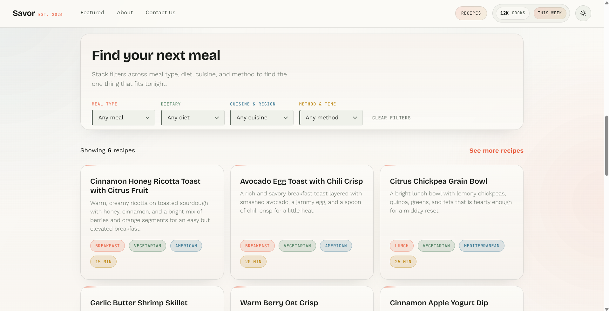
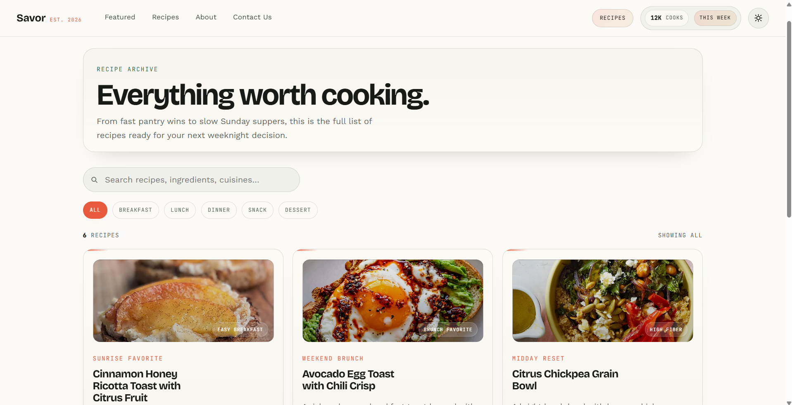
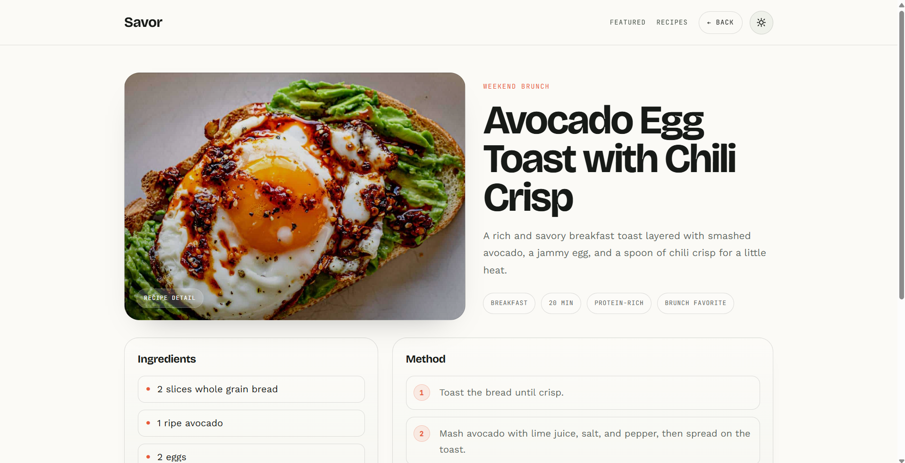

# Savor

A simple recipe website for finding meals to cook, exploring recipes, and getting quick food inspiration.

## About

Savor is a clean and modern recipe app that helps users:

- browse featured dishes
- search for recipes
- filter by cuisine, diet, and meal type
- view detailed recipe information
- discover ideas for home cooking

The goal is to make finding dinner ideas easier, faster, and more enjoyable.

## Screenshots

  
  
  
  

## Developed By

This project was developed by me and built as a lightweight web app for recipe browsing.

## Tech Stack

| **Frontend** | **Backend/Database** | **Hosting/Deployment** |
| :----------: | :------------------: | :--------------------: |
|     HTML     |       Supabase       |         Vercel         |
|     CSS      |                      |                        |
|  Javascript  |                      |                        |

## Features

- homepage with featured recipes
- recipe archive page
- search and filter tools
- recipe detail view
- responsive and mobile-friendly design
- simple, clean user experience

## AI Assistance and Vibe Coding

This project was created with the help of AI tools and a vibe coding workflow.

That means:

- ideas were turned into working code quickly
- the design and layout were improved with AI support
- the project was built in a fast, creative, and practical way
- the focus was on a smooth and user-friendly experience

## Future Improvements

Planned ideas for future updates:

- save favorite recipes
- user accounts and profile pages
- meal planner for weekly cooking
- more detailed recipe cards
- smarter search and filtering
- recipe rating and comments
- improved mobile experience and animations

---

Savor - find what to cook.
